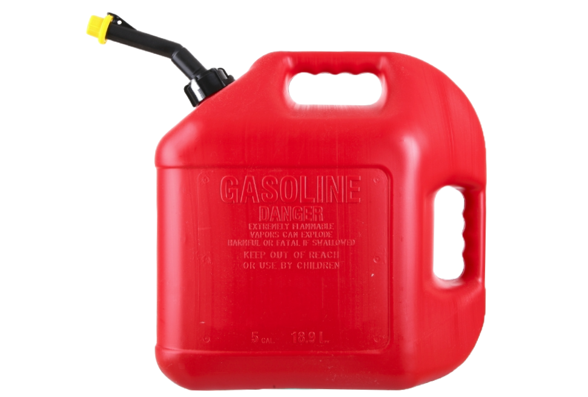

# Gas.dev



# Warning

This is an experimental work-in-progress. Things can and will change.

That said, the goal is to ship v1.0 ASAP. You can follow an active roadmap here: TODO link

Also, please limit contributions to minor bug fixes, issues labeled "Help welcomed", and discussion.

Your feedback is the most valuable contribution. I'd (@shaneuuid | TODO GitHub link | TODO X link) love to hear your critiques, ideas, feature requests, etc: TODO link to GitHub discussions.

# Introduction

## What is it

Gas.dev is an open source framework for building Cloudflare-based APIs, apps, bots, cron jobs, and webhooks.

## 60 second demo

TODO: Quick video introduction

# Quick start

## Creating a project

TODO

# Project structure

TODO

# Naming convention

TODO

# @gas-dev/cli

## Installation

`npm install @gas-dev/cli`

`pnpm add @gas-dev/cli`

## Usage

`gas [command]`

## Commands

### help, -h, --help

TODO

### new

TODO

### Up

Deploy resources to the cloud.

# @gas-dev/resources

## Overview

TODO

## Resources

### Cloudflare KV

TODO

### Cloudflare Workers

TODO

# gas.config.json

TODO

# Naming conventions

TODO: Entity groups, entities, resources, etc.

# Terminology

TODO

# Guides

TODO

# Architecture

### Projects

A _project_ is the "thing" being built.

### Systems

A _system_ is a collection of interfacing _resources_ that form the cloud infrastructure of a project.

### Resources

A resource is an individual cloud infrastructure service (e.g. a Cloudflare Worker, D1 database, or KV store) that together form a system.

### Graphs

Gas.dev computes systems and resources as [_graphs_](https://en.wikipedia.org/wiki/Graph_(discrete_mathematics)), where systems are graphs and resources are nodes on the graphs.

These types of graphs are referred to as [_directed acyclic graphs_](https://en.wikipedia.org/wiki/Directed_acyclic_graph). That is, graphs (systems) whose edges (arrows) point in one direction, from node (resource) to node (resource), and have no loops.

TODO: Insert graph image

### Resources are packages

Gas.dev can compute graphs because resources are packages.

Every resource has a `package.json`. Thus, resources can be added as package dependencies of other resources.

#### Example

In this example, the Cloudflare KV store resource has been added as a package dependency to the Cloudflare Worker resource. Thus, the Cloudflare Worker resource is dependent on the Cloudflare KV store.

TODO: Insert build and dev scripts in package.jsons below.

Cloudflare Worker `gas/core-base-api/package.json`:
```json
{
  "name": "core-base-api",
  "type": "module",
  "main": "build/_core.base.api.index.js",
  "types": "build/_core.base.api.index.d.ts",
  "scripts": {...},
  "dependencies": {
    "core-base-kv": "workspace:^",
  }
}

```

Cloudflare KV `gas/core-base-kv/package.json`:
```json
{
  "name": "core-base-kv",
  "type": "module",
  "main": "dist/_core.base.kv.index.js",
  "types": "dist/_core.base.kv.index.d.ts",
  "scripts": {...}
}
```

TODO: Insert image of Cloudflare Worker + KV graph

### Resources export their configs

Every resource defines and exports their config from an `index.ts` file. That means:
1) The `index.ts` and config can be transformed to JS, which is the `main` entry point for each resource `package.json`.
2) The `index.ts` config values can be imported and used in dependent resources with full typesafety.
3) Configs exist next to the code they control.

This is a hybrid Infrastructure from/as Code model.

#### Example

Cloudflare Worker `gas/core-base-api/_core.base.api.index.ts`:

```ts
import { coreBaseKv } from "core-base-kv";
import { Hono } from "hono";
import { KvBindings, setCloudflareWorker } from "@gas-dev/resources";

export const coreBaseApi = setCloudflareWorker({
	id: "core:base:cloudflare-worker:12345",
	name: "CORE_BASE_API",
	kv: [
		{
			binding: coreBaseKv.name,
		},
	],
} as const);

type Bindings = KvBindings<(typeof coreBaseApi)["kv"]>;

const app = new Hono<{ Bindings: Bindings }>();

app.get("/", (c) => c.text("Hello, World!"));

app.get("/get-example-kv-value", async (c, next) => {
	const value = await c.env.CORE_BASE_KV.get("example");
	return c.text(`Got ${value} successfully!`);
});

export default app;

```

### Gas directory

Gas.dev projects are stored

# Notes

## Graphs

TODO
